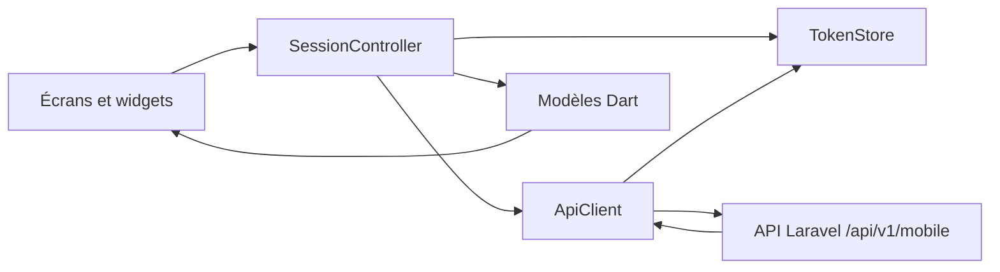
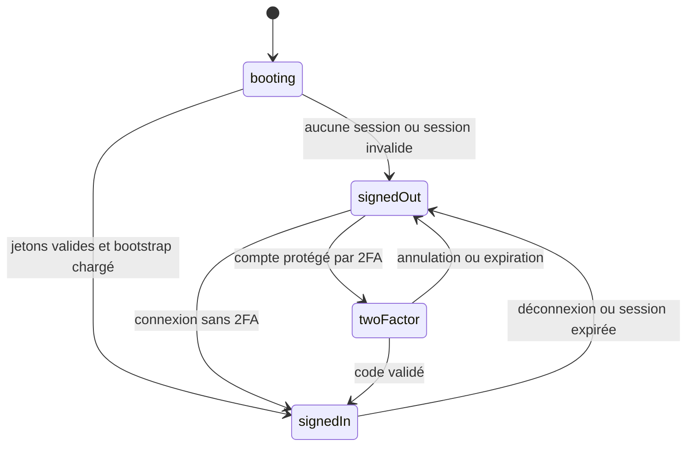

# Architecture de l’application

## Principes

Le projet suit une architecture Flutter volontairement simple : les écrans sont regroupés par fonctionnalité, tandis que l’accès réseau, la session, les modèles et le stockage sécurisé sont centralisés dans `lib/core`.

L’application n’accède jamais directement à la base de données ni au listener GPS. Toutes les données transitent par l’API privée versionnée sous `/api/v1/mobile`.

## Flux principal

| Couche | Responsabilité |
| --- | --- |
| `features` | Affichage, interactions et états propres à chaque écran |
| `SessionController` | Cycle d’authentification et données partagées de l’espace connecté |
| `ApiClient` | Requêtes HTTP, sérialisation, erreurs et renouvellement des jetons |
| `TokenStore` | Stockage sécurisé des jetons, de la session et de l’identifiant appareil |
| `models` | Conversion des réponses JSON en objets utilisés par l’interface |
| `localization` | Traductions FR/EN et préférence de langue |
| `theme` | Identité visuelle et personnalisation retournée par le serveur |

## Cycle de session

`SessionController` expose quatre étapes :

Au démarrage, les jetons sont lus depuis le stockage sécurisé. Si une session existe, l’application charge d’abord `/bootstrap`, puis le dashboard, les véhicules, les alertes et, si l’utilisateur possède `map_view`, les véhicules cartographiques.

## Authentification et renouvellement

1. La connexion transmet l’e-mail, le mot de passe, la plateforme et l’identifiant stable de l’appareil.
2. Si la 2FA est requise, aucun jeton d’accès n’est enregistré avant validation du challenge.
3. Après authentification, les jetons d’accès et de rafraîchissement sont stockés avec `flutter_secure_storage`.
4. Lorsqu’une requête authentifiée reçoit une erreur non autorisée, `ApiClient` tente une seule rotation avec le jeton de rafraîchissement.
5. La nouvelle paire remplace l’ancienne. Si la rotation échoue, les jetons locaux sont supprimés.

## Navigation et permissions

`HomeShell` construit dynamiquement la barre de navigation :

- dashboard client ou supervision superadmin ;
- carte, seulement avec la permission `map_view` ;
- véhicules ;
- alertes ;
- profil et préférences.

Depuis les listes « Activité de la flotte », « Activité du parc » et « Véhicules », un appui ne charge pas une seconde liste ni une fiche de détails intermédiaire. `HomeShell` crée une demande de focus unique, active l’onglet Carte, puis `MapScreen` retrouve le véhicule dans le snapshot live, centre la caméra sur son marqueur et affiche sa fiche d’actions. Les détails, trajets et événements restent accessibles depuis cette fiche cartographique.

Les indicateurs des dashboards sont également des points de navigation : « Flottes » rejoint la répartition, « Véhicules » ouvre le parc complet, « En ligne » ouvre le parc avec son filtre actif, « À vérifier » ouvre les alertes et, sur le dashboard client, « En déplacement » ouvre la carte en vue générale.

La destination « Alertes » affiche le nombre d’alertes dont le statut serveur est `new`. Le badge est masqué à zéro et plafonné visuellement à `99+`. La liste conserve la valeur réelle dans son en-tête, permet de filtrer les nouvelles et les distingue par un badge « Nouveau », une bordure teintée et la couleur de sévérité.

La visibilité d’un écran n’est pas une mesure de sécurité suffisante. Le serveur reste responsable de l’autorisation et du cloisonnement par flotte sur chaque endpoint.

## Carte et suivi direct

La carte charge uniquement les véhicules possédant des coordonnées valides. Quand elle est active et que le suivi direct est activé :

- un snapshot est demandé toutes les 10 secondes ;
- un déplacement valide est interpolé pendant 5 secondes ;
- les états affichés distinguent mouvement, stationnement, moteur allumé à l’arrêt, maintenance, inactivité, hors ligne et en ligne ;
- les filtres et la recherche sont appliqués localement sur le snapshot courant ;
- l’ouverture de la fiche d’un véhicule suspend la superposition de la liste afin d’éviter les panneaux concurrents.

La position du téléphone n’est demandée qu’après action sur « Ma position ». Aucun suivi en arrière-plan n’est réalisé.

## Modèles et robustesse des réponses

Les conversions JSON sont concentrées dans `lib/core/models/app_models.dart`. Les helpers de conversion tolèrent les champs optionnels et les formes numériques courantes retournées par Laravel.

Lorsqu’un champ serveur devient obligatoire pour l’interface :

1. mettre à jour le Resource ou service Laravel ;
2. mettre à jour le modèle Dart ;
3. ajouter un test de parsing dans `test/models_test.dart` ;
4. adapter les tests de widgets concernés.

## Localisation

Les traductions FR/EN sont centralisées dans `AppLocalizations`. La préférence peut suivre le téléphone ou être forcée par l’utilisateur. Elle est conservée dans le stockage sécurisé sous la clé `exad_app_locale`.

Toute nouvelle chaîne visible doit être ajoutée dans les deux dictionnaires. Éviter les textes métier codés directement dans les widgets.

## Règles d’évolution

- Garder les appels HTTP hors des widgets ; passer par `SessionController` et `ApiClient`.
- Ne jamais journaliser les mots de passe, challenges 2FA ou jetons.
- Préserver le filtrage serveur même si un filtrage local existe pour l’ergonomie.
- Ajouter les états métier dans `VehicleData` avant de dupliquer leur interprétation dans plusieurs écrans.
- Tester les formats de réponse et les écrans critiques après toute évolution du contrat API.
