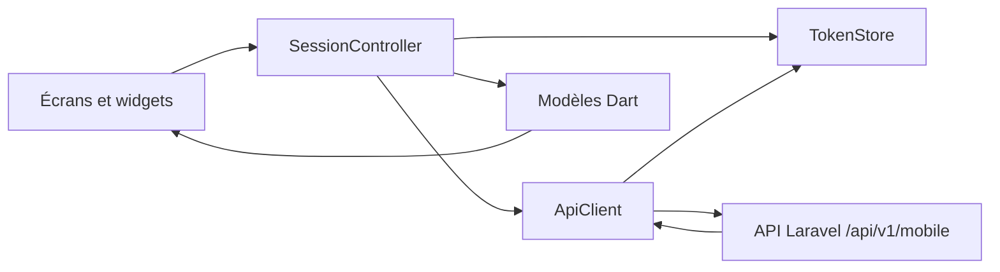
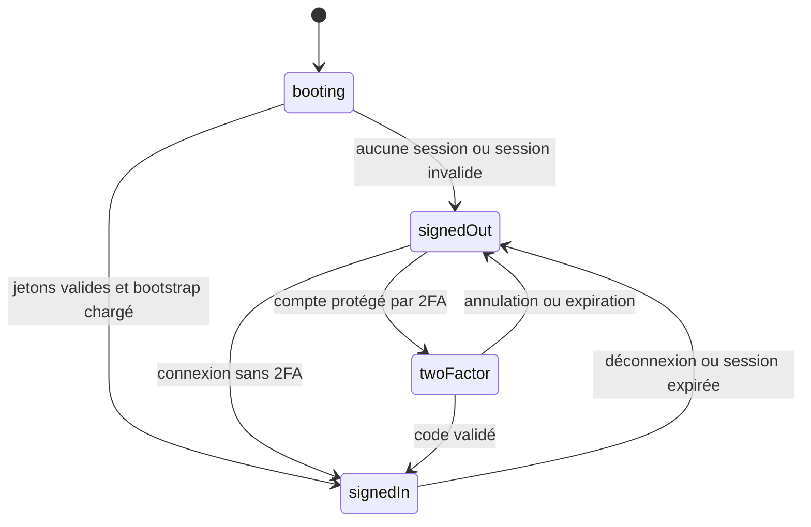

# Architecture de l’application

## Principes

Le projet suit une architecture Flutter volontairement simple : les écrans sont regroupés par fonctionnalité, tandis que l’accès réseau, la session, les modèles et le stockage sécurisé sont centralisés dans `lib/core`.

L’application n’accède jamais directement à la base de données ni au listener GPS. Toutes les données transitent par l’API privée versionnée sous `/api/v1/mobile`.

## Flux principal

```mermaid
flowchart LR
    UI[Écrans et widgets] --> Session[SessionController]
    Session --> API[ApiClient]
    Session --> Store[TokenStore]
    API --> Store
    API --> Backend[API Laravel /api/v1/mobile]
    Backend --> API
    Session --> Models[Modèles Dart]
    Models --> UI
```

| Couche | Responsabilité |
| --- | --- |
| `features` | Affichage, interactions et états propres à chaque écran |
| `SessionController` | Cycle d’authentification et données partagées de l’espace connecté |
| `ApiClient` | Requêtes HTTP, sérialisation, erreurs et renouvellement des jetons |
| `TokenStore` | Stockage sécurisé des jetons, de la session et de l’identifiant appareil |
| `models` | Conversion des réponses JSON en objets utilisés par l’interface |
| `localization` | Traductions FR/EN et préférence de langue |
| `theme` | Identité visuelle et personnalisation retournée par le serveur |

## Cycle de session

`SessionController` expose quatre étapes :

```mermaid
stateDiagram-v2
    [*] --> booting
    booting --> signedOut: aucune session ou session invalide
    booting --> signedIn: jetons valides et bootstrap chargé
    signedOut --> twoFactor: compte protégé par 2FA
    signedOut --> signedIn: connexion sans 2FA
    twoFactor --> signedIn: code validé
    twoFactor --> signedOut: annulation ou expiration
    signedIn --> signedOut: déconnexion ou session expirée
```

Au démarrage, les jetons sont lus depuis le stockage sécurisé. Si une session existe, l’application charge d’abord `/bootstrap`, puis le dashboard, les véhicules, les alertes et, si l’utilisateur possède `map_view`, les véhicules cartographiques.

## Authentification et renouvellement

1. La connexion transmet l’e-mail, le mot de passe, la plateforme et l’identifiant stable de l’appareil.
2. Si la 2FA est requise, aucun jeton d’accès n’est enregistré avant validation du challenge.
3. Après authentification, les jetons d’accès et de rafraîchissement sont stockés avec `flutter_secure_storage`.
4. Lorsqu’une ou plusieurs requêtes authentifiées reçoivent une erreur non autorisée, `ApiClient` partage une rotation unique avec le jeton de rafraîchissement.
5. La nouvelle paire remplace l’ancienne. Si la rotation échoue, les jetons locaux sont supprimés.

## Navigation et permissions

`HomeShell` construit dynamiquement la barre de navigation :

- dashboard client ou supervision superadmin ;
- carte, seulement avec la permission `map_view` ;
- profil et préférences.

La barre inférieure ne contient donc que « Carte », « Accueil » et « Plus » pour
un client autorisé à consulter la carte. Les véhicules et les alertes s’ouvrent
comme des pages secondaires depuis les indicateurs du dashboard, avec une action
de retour explicite.

Depuis les listes « Activité de la flotte », « Activité du parc » et « Véhicules », un appui ne charge pas une seconde liste ni une fiche de détails intermédiaire. `HomeShell` crée une demande de focus unique, active l’onglet Carte, puis `MapScreen` retrouve le véhicule dans le snapshot live, centre la caméra sur son marqueur et affiche sa fiche d’actions. Les détails, trajets et événements restent accessibles depuis cette fiche cartographique.

Les indicateurs des dashboards sont également des points de navigation : « Flottes » rejoint la répartition, « Véhicules » ouvre le parc complet, « En ligne » ouvre le parc avec son filtre actif, « À vérifier » ouvre les alertes et, sur le dashboard client, « En déplacement » ouvre la carte en vue générale.

La page « Alertes » conserve la valeur réelle des nouvelles alertes, permet de
les filtrer et les distingue par un badge « Nouveau », une bordure teintée et la
couleur de sévérité.

La visibilité d’un écran n’est pas une mesure de sécurité suffisante. Le serveur reste responsable de l’autorisation et du cloisonnement par flotte sur chaque endpoint.

L’espace Plus donne accès aux chauffeurs en lecture seule et aux départements. La gestion des départements est activée pour l’admin client et le superadmin, tandis que l’utilisateur normal conserve une vue sans action. Dans le détail d’un véhicule, les sorties du traceur n’apparaissent que lorsque le serveur confirme simultanément sa compatibilité et l’autorisation du compte. DOUT1 et DOUT2 sont affichées et commandées séparément ; une commande ne doit jamais modifier la sortie voisine.

## Carte et suivi direct

Le panneau Véhicules présente quatre compteurs avec icônes : en ligne, hors ligne, en mouvement et en parking (P encerclé). Les quatre indicateurs sont alignés sur une seule ligne, sans cartes, bordures ni fonds individuels, avec les libellés sous les icônes et les nombres. Ils remplacent le nom et l’adresse e-mail du compte et sont calculés sur le snapshot complet de la carte, indépendamment de la recherche et du filtre. L’actualisation manuelle reste disponible à côté de l’heure de mise à jour.

Chaque en-tête de flotte permet de replier ou développer ses véhicules et conserve le nombre de véhicules visible. Les groupes et leur état sont identifiés par l’ID de flotte et restent stables pendant les actualisations. Une nouvelle recherche développe les groupes pour révéler les résultats.

Les compteurs compacts utilisent quatre pictogrammes Material homogènes placés dans des médaillons circulaires discrets de 28 pixels : connexion verte, déconnexion rouge, direction violette et P bleu. Des séparateurs verticaux fins structurent le bandeau sans encadrer individuellement les statuts. Le nombre est mis en évidence et le libellé reste secondaire. La navigation inférieure reprend la couleur principale du thème, y compris la zone de navigation Android, avec des icônes et libellés contrastés selon la luminosité de cette couleur.

La navigation des écrans authentifiés s'exécute dans un navigateur imbriqué à l'intérieur de `HomeShell`. La barre inférieure reste ainsi visible sur les écrans racines comme sur les listes et détails ouverts depuis le tableau de bord ou le menu Plus. Sélectionner une destination depuis un sous-écran ferme d'abord la pile secondaire puis affiche la destination demandée. Les écrans de connexion et de double authentification restent volontairement hors de cette navigation.

Le menu Plus présente un espace `Gestion du parc` uniquement lorsque le bootstrap fournit les trois capacités `management.fleets`, `management.vehicles` et `management.trackers`. Le superadmin peut y consulter et créer des flottes, choisir un admin responsable disponible, créer des véhicules dans une flotte, puis créer et affecter un traceur à un véhicule encore libre.

Une entrée distincte `Gestion des utilisateurs` dépend de `management.users`. Le superadmin choisit le rôle, la flotte et les permissions des utilisateurs simples. L'admin client ne voit que les utilisateurs simples de sa propre flotte ; même si l'application est modifiée, le serveur force cette flotte et le rôle `user`. Les mots de passe respectent les mêmes exigences que le web et ne sont jamais retournés par l'API. Le serveur contrôle à nouveau le rôle sur chaque endpoint de gestion et demeure la source d'autorité.

La carte charge uniquement les véhicules possédant des coordonnées valides. Quand elle est active et que le suivi direct est activé :

- un snapshot est demandé toutes les 10 secondes ;
- un déplacement valide est interpolé pendant 5 secondes ;
- les états affichés distinguent mouvement, stationnement, moteur allumé à l’arrêt, maintenance, inactivité, hors ligne et en ligne ;
- les filtres et la recherche sont appliqués localement sur le snapshot courant ;
- l’ouverture de la fiche d’un véhicule suspend la superposition de la liste afin d’éviter les panneaux concurrents.

La position du téléphone n’est demandée qu’après action sur « Ma position ». Aucun suivi en arrière-plan n’est réalisé.

## Modèles et robustesse des réponses

Les conversions JSON sont concentrées dans `lib/core/models/app_models.dart`. Les helpers de conversion tolèrent les champs optionnels et les formes numériques courantes retournées par Laravel.

Lorsqu’un champ serveur devient obligatoire pour l’interface :

1. mettre à jour le Resource ou service Laravel ;
2. mettre à jour le modèle Dart ;
3. ajouter un test de parsing dans `test/models_test.dart` ;
4. adapter les tests de widgets concernés.

## Localisation

Les traductions FR/EN sont centralisées dans `AppLocalizations`. La préférence peut suivre le téléphone ou être forcée par l’utilisateur. Elle est conservée dans le stockage sécurisé sous la clé `exad_app_locale`.

Toute nouvelle chaîne visible doit être ajoutée dans les deux dictionnaires. Éviter les textes métier codés directement dans les widgets.

## Règles d’évolution

- Garder les appels HTTP hors des widgets ; passer par `SessionController` et `ApiClient`.
- Ne jamais journaliser les mots de passe, challenges 2FA ou jetons.
- Préserver le filtrage serveur même si un filtrage local existe pour l’ergonomie.
- Ajouter les états métier dans `VehicleData` avant de dupliquer leur interprétation dans plusieurs écrans.
- Tester les formats de réponse et les écrans critiques après toute évolution du contrat API.

## 2026-10-05 — Historique sur la carte, build 40

Panneau TripHistoryPanel intégré à MapScreen : résumé de période, chronologie par date, trajets/parkings, sélection exclusive ou multiple, repères départ (lecture) et arrivée (drapeau damier) dessinés localement, repère P et lecture du tracé avec pause/vitesse/progression. Le panneau reste visible pendant la sélection, peut être réduit et se ferme sans laisser de tracé. L’actualisation des véhicules continue mais le centrage automatique est suspendu pendant la consultation. Les dates personnalisées passent par SessionController et ApiClient. Modèles additifs VehicleHistoryItem et coordonnées exactes, compatibles avec un serveur ne renvoyant pas encore history. Les coupures de transmission sont distinctes des stationnements ; aucun prolongement artificiel du parking jusqu’à minuit.

API de production mise à jour : GET /api/v1/mobile/vehicles/{vehicle}/trips contient désormais history.items, parking_count, parking_seconds et elapsed_seconds ; start_coordinates/end_coordinates sont les extrémités GPS, indépendantes du tracé éventuellement ajusté sur la route. Les droits de flotte et le masquage des identifiants du traceur restent appliqués. Déploiement : 2026-10-05T12:56:46.627123+00:00, sauvegarde /var/backups/api-history-20261005-125645.tar.gz, GPS non redémarré. Le correctif de géocodage séparé en attente d’autorisation n’a pas été inclus.

Validation du lot : 39 tests Flutter réussis, dont 4 nouveaux tests de modèles et interactions (chronologie, parking seul, panneau étroit, réponse obsolète, arrêt de la lecture lors de la fermeture). Flutter analyze : aucune erreur ni avertissement. 10 tests PHP API/historique réussis, 43 assertions. Les tests d’interfaces utilisent des données synthétiques ; pas de recette sur téléphone réel ni de validation visuelle du fond Google Maps pour ce build.

Bundle signé : build/app/outputs/bundle/release/EXAD-Tracking-1.0.0+40.aab
Version : 1.0.0+40 ; package : com.exad.exad_tracking_mobile.
SHA-256 : 7616ba2a79edd8f2f22ba336652690da44d4fad0b63aeb50f00360e3313a1826
Taille : 47243050 octets. Bundletool valide le bundle et le versionCode 40. Certificat d’importation identique au build 39 ; huit bibliothèques 64 bits et configuration du bundle compatibles avec les pages 16 Ko. Clé Maps et signatures existantes conservées. Le bundle est prêt à importer dans Google Play ; aucune publication sur le store effectuée.

## 6 octobre 2026 — Design du panneau et build 41

TripHistoryPanel reprend le thème de l’application : en-tête à couleur primaire, nom du véhicule, surfaces arrondies, contrôles plus lisibles et cartes distinctes pour trajets/parkings. MapScreen place le panneau à 34 % de la hauteur disponible sur téléphone (138–280 px), à 16 px du haut sur grand écran, avec marges Google Maps adaptées à la réduction/expansion. Les données de session et les clés de signature/Maps sont conservées.

Vérifications de ce lot : analyse statique ciblée des deux écrans sans problème ; 4 tests trip_history_test.dart réussis (modèles, sélection, défilement vers un parking hors écran, largeur 300 px, réponses obsolètes et arrêt de la lecture). Le test existant utilise désormais scrollUntilVisible pour le chargement différé des lignes agrandies. Pas de nouvelle suite Flutter complète.

Build 1.0.0+41 : D:/App/Codex/exad-tracking-mobile/build/app/outputs/bundle/release/EXAD-Tracking-1.0.0+41.aab
SHA-256 : 07850f00b048af25eaac3777cd5e1c476f9373aae91802726cfcfe835fff03ab
Taille : 47264141 octets. Bundletool valide le bundle et versionCode 41 ; certificat d’importation identique au build 39, huit bibliothèques 64 bits et configuration vérifiées pour pages de 16 Ko. Build 40 conservé. Aucune publication Google Play effectuée.

APK de recette dérivé de ce bundle avec la signature debug existante, installé par adb install -r dans Pixel_9_Pro (emulator-5554), session conservée, activité principale démarrée et versionCode 41 contrôlé. Recette visuelle du résumé et du détail sur un véhicule avec parking seul, fond Google Maps visible, panneau remonté et lisible. Un premier chargement a affiché une erreur générique, puis a réussi après Réessayer (HTTP 200 observé) ; cause initiale non établie, aucun correctif réseau prétendu. Les trajets, choix de vitesse et multisélection sont couverts par les tests ciblés, sans nouvelle recette physique. Captures et reçus : DASHCAM/analysis/history-design-20261005/.

## 8 octobre 2026 — Historique ancré en haut, build 43

Demande : supprimer l'espace cartographique laissé au-dessus du panneau Historique mobile ; garder l'en-tête réduit en haut, sous les informations du véhicule, et dégager la carte en bas.

MapScreen : origine verticale mobile à 136 px (58 px de barre + 70 px de télémétrie + 8 px d'écart), indépendante de l'état réduit et de la hauteur du téléphone, au lieu de 34 % de l'écran. En portrait, hauteur maximale du panneau limitée à 65 % de la zone restante (plancher de 280 px dans la limite disponible), liste défilante ; espace conservé sous le panneau. Sur écran large, présentation latérale conservée. Boutons de recentrage et de position du téléphone déplacés en bas à droite pendant la consultation en portrait.

La marge Google Maps réserve désormais la partie supérieure occupée, mesurée après mise en page. Le trajet est recadré après mise à jour de cette marge (délai de 180 ms pour l'application native, génération invalidée à la fermeture ou lors d'une autre sélection). Réduction/expansion : en-tête immobile et nouveau cadrage dans l'espace dégagé ; marge de 48 px autour des trajets pour les icônes. Les requêtes GPS, le contenu de l'historique et la lecture sont conservés.

Validation : analyse Flutter ciblée sans problème ; 10 tests existants d'historique et de politique GPS réussis, rejoués après l'ajustement du cadrage. Aucun nouveau test miroir de la disposition. Build release compilé, validation bundletool et versionCode 43, certificat d'importation identique au build 39 ; huit bibliothèques 64 bits et configuration du bundle vérifiées pour les pages 16 Ko. Version de contrôle dérivée du bundle avec la signature debug de l'émulateur, mise à jour par adb install -r avec session conservée. Recette visuelle portrait sur Pixel_9_Pro / emulator-5554, véhicule Suzuki Horly : panneau ouvert sous la télémétrie, barre réduite à la même hauteur, fond Google Maps et icônes départ/arrivée visibles dans la zone inférieure. Pas d'essai sur téléphone physique ni de publication Google Play.

Bundle signé : D:/App/Codex/exad-tracking-mobile/build/app/outputs/bundle/release/EXAD-Tracking-1.0.0+43.aab
Taille : 47267963 octets ; SHA-256 : cb747df744dcc1be55d5db789f196cd97bfb21815f12e222e6942364811dbef6.
Notes françaises : build/app/outputs/bundle/release/EXAD-Tracking-1.0.0+43-notes-fr.txt.
Sources avant/après, journaux, reçu et captures : DASHCAM/analysis/mobile-history-top-20261008/. EXAD Tracking web/API et EXADCAM non modifiés ; aucun déploiement serveur dans ce lot.
